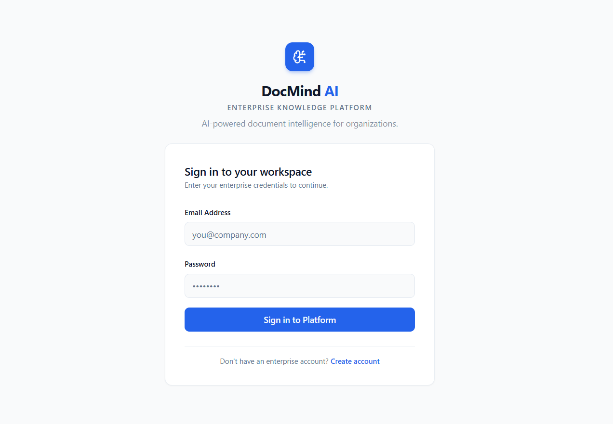
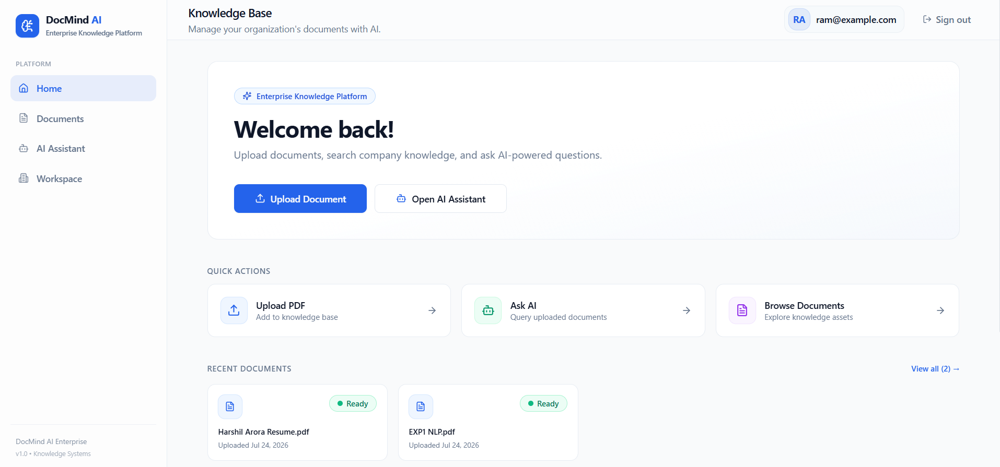
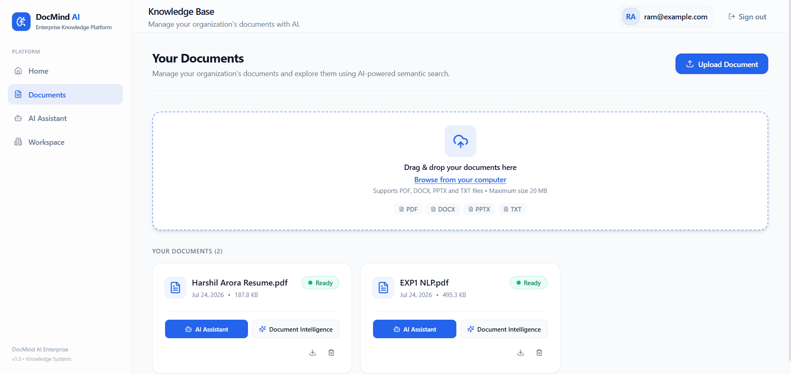
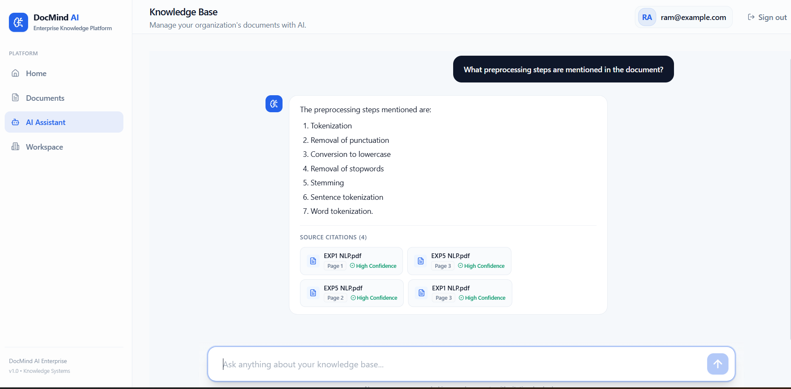

# DocMind AI

Enterprise Document Intelligence Platform powered by Retrieval-Augmented Generation (RAG)

DocMind AI is a full-stack document intelligence platform that enables users to upload PDF documents, build semantic vector indexes, and interact with their knowledge base through natural language. The application combines modern web technologies with Retrieval-Augmented Generation (RAG) to deliver context-aware responses supported by source citations.

The project demonstrates the implementation of an end-to-end AI application using React, FastAPI, PostgreSQL, FAISS, LangChain, and Large Language Models. It focuses on semantic document retrieval, secure authentication, and a modular architecture suitable for learning and extending RAG-based systems.

---
## Table of Contents

- [Overview](#overview)
- [Features](#features)
- [Design Goals](#design-goals)
- [Technology Stack](#technology-stack)
- [System Architecture](#system-architecture)
- [Component Responsibilities](#component-responsibilities)
- [Application Workflow](#application-workflow)
- [Project Structure](#project-structure)
- [Getting Started](#getting-started)
- [Configuration](#configuration)
- [API Overview](#api-overview)
- [Screenshots](#screenshots)
- [Future Enhancements](#future-enhancements)
- [License](#license)
- [Author](#author)

## Overview

Traditional keyword-based document search often struggles to retrieve relevant information when the wording of a query differs from the original document. Large language models can generate fluent answers, but without access to domain-specific knowledge they may produce inaccurate or unsupported responses.

DocMind AI addresses these challenges using a Retrieval-Augmented Generation (RAG) pipeline. Documents are processed into semantic embeddings and indexed using FAISS. When a user submits a question, the system retrieves the most relevant document chunks before sending the context to the language model. This approach improves response relevance while providing citations to the original document sections.

The application is designed as a modular client-server system consisting of:

- A React frontend for document management and conversational interaction.
- A FastAPI backend exposing REST APIs.
- PostgreSQL for user accounts and document metadata.
- FAISS for vector similarity search.
- LangChain for retrieval orchestration.
- Groq LLM for answer generation.

---

## Design Goals

The project was developed with the following objectives:

- Build an end-to-end Retrieval-Augmented Generation (RAG) application using a modern full-stack architecture.
- Demonstrate semantic document retrieval using vector embeddings and FAISS.
- Design a modular backend that separates authentication, document processing, and AI services.
- Provide grounded AI responses supported by document citations.
- Create a clean and responsive user interface for document interaction.

---

## Features

| Feature | Description |
|---------|-------------|
| User Authentication | Secure registration and login using JWT authentication |
| PDF Upload | Upload and process PDF documents |
| Semantic Search | Retrieve relevant document sections using vector similarity search |
| AI Assistant | Ask natural language questions about uploaded documents |
| Source Citations | Responses include references to supporting document sections |
| Document Management | Organize and manage uploaded documents |
| REST API | FastAPI-based backend with modular architecture |
| Responsive Interface | React and TypeScript frontend with Tailwind CSS |

---

## Technology Stack

### Frontend

- React
- TypeScript
- Vite
- Tailwind CSS
- shadcn/ui
- TanStack Query
- Axios

### Backend

- FastAPI
- SQLAlchemy
- Alembic
- PostgreSQL
- JWT Authentication

### AI & Retrieval

- LangChain
- Sentence Transformers
- FAISS
- Groq API

### Deployment

- Frontend: Vercel
- Backend: Local deployment

## Key Learning Outcomes

This project provided practical experience with:

- Designing RESTful APIs using FastAPI
- JWT-based authentication and authorization
- Relational database modeling with PostgreSQL
- Retrieval-Augmented Generation (RAG) architecture
- Semantic search using Sentence Transformers and FAISS
- Prompt orchestration with LangChain
- Building modern React applications with TypeScript
- Deploying frontend applications with Vercel

## System Architecture

DocMind AI follows a modular client-server architecture...

<p align="center">
  
</p>

<p align="center">
  <em>Figure 1. High-level architecture of the DocMind AI platform.</em>
</p>

The architecture illustrates how user requests flow through the frontend, backend, database, and Retrieval-Augmented Generation (RAG) pipeline before returning grounded responses with source citations.

---

## Component Responsibilities

The following components work together to provide document ingestion, semantic retrieval, and AI-powered question answering.

| Component | Responsibility |
|-----------|----------------|
| **React Frontend** | Provides the user interface for authentication, document management, and AI-powered conversations. |
| **FastAPI Backend** | Exposes REST APIs, manages authentication, and orchestrates the RAG workflow. |
| **PostgreSQL** | Stores user accounts, authentication data, and document metadata. |
| **RAG Pipeline** | Extracts text, generates embeddings, builds the FAISS index, and retrieves relevant document chunks. |
| **LangChain + Groq LLM** | Uses retrieved context to generate grounded responses with source citations. |
---

## Application Workflow

The following sequence describes how a document is processed and how questions are answered.

### 1. User Authentication

Users create an account and authenticate using JWT-based authentication. Protected endpoints require a valid access token before documents can be uploaded or queried.

### 2. Document Upload

Users upload PDF documents through the web interface. The backend validates the uploaded file before beginning the processing pipeline.

### 3. Text Extraction

The document text is extracted and cleaned to remove unnecessary formatting while preserving meaningful content.

### 4. Chunk Generation

The extracted text is divided into overlapping chunks. Chunking ensures that semantic retrieval operates on manageable sections instead of the entire document.

### 5. Embedding Generation

Each chunk is converted into a dense vector representation using the Sentence Transformers embedding model. These vectors capture semantic meaning rather than simple keyword frequency.

### 6. Vector Indexing

Generated embeddings are stored inside a FAISS index, allowing efficient similarity search over thousands of document chunks.

### 7. Question Processing

When the user submits a question, the same embedding model converts the query into a vector representation.

### 8. Semantic Retrieval

The query embedding is compared against the FAISS index to retrieve the most relevant document chunks.

### 9. Response Generation

LangChain combines the retrieved context with the user's question and constructs a prompt for the language model. The Groq LLM generates a grounded response using only the retrieved information.

### 10. Citation Generation

The application returns the generated answer together with references to the document sections that supported the response, allowing users to verify the information.

## Technology Stack

| Category | Technologies |
|----------|--------------|
| Frontend | React, TypeScript, Vite, Tailwind CSS, shadcn/ui, TanStack Query, Axios |
| Backend | FastAPI, SQLAlchemy, Alembic, PostgreSQL, JWT Authentication |
| AI & Retrieval | LangChain, Sentence Transformers, FAISS, Groq API |
| Development | Git, Docker, Docker Compose |

---

## Project Structure

```
docmind-ai/
│
├── backend/
│   ├── alembic/                 # Database migrations
│   ├── app/
│   │   ├── api/                 # API routes
│   │   ├── core/                # Configuration and security
│   │   ├── db/                  # Database configuration
│   │   ├── models/              # SQLAlchemy models
│   │   ├── schemas/             # Pydantic schemas
│   │   ├── services/            # Business logic
│   │   ├── vectorstore/         # FAISS indexing
│   │   └── main.py              # Application entry point
│   │
│   ├── storage/                 # Uploaded documents
│   ├── requirements.txt
│   └── Dockerfile
│
├── frontend/
│   ├── public/
│   ├── src/
│   │   ├── components/
│   │   ├── hooks/
│   │   ├── pages/
│   │   ├── services/
│   │   ├── lib/
│   │   └── main.tsx
│   │
│   ├── package.json
│   └── Dockerfile
│
├── docker-compose.yml
├── README.md
└── DocMind_AI_Architecture.md
```

---

## Installation

### Prerequisites

Before running the application, ensure the following software is installed:

- Python 3.11 or later
- Node.js 20 or later
- PostgreSQL
- Git

---

### Clone the Repository

```bash
git clone https://github.com/harshil68190/docmind-ai.git

cd docmind-ai
```

---

### Backend Setup

Create a virtual environment.

```bash
cd backend

python -m venv venv
```

Activate the environment.

**Windows**

```bash
venv\Scripts\activate
```

**Linux / macOS**

```bash
source venv/bin/activate
```

Install dependencies.

```bash
pip install -r requirements.txt
```

Create a `.env` file.

```env
DATABASE_URL=
SECRET_KEY=
ALGORITHM=HS256
ACCESS_TOKEN_EXPIRE_MINUTES=30

GROQ_API_KEY=
```

Run database migrations.

```
alembic upgrade head

```
Start the backend.

```bash
uvicorn app.main:app --reload

```
The backend will be available at

```
http://localhost:8000

```
---

### Frontend Setup

Open another terminal.

```bash
cd frontend

npm install
```
Create a `.env` file.

```env
VITE_API_BASE_URL=http://localhost:8000/api/v1
```
Start the development server.

```bash
npm run dev
```
The frontend will be available at
```
http://localhost:5173

```
## Running with Docker

The repository also includes Docker and Docker Compose configurations for containerized development.

```
docker compose up --build
```
## API Overview

The backend exposes RESTful endpoints for authentication, document management, and AI-powered document interaction.

| Method | Endpoint | Description |
|----------|----------|-------------|
| POST | `/api/v1/auth/register` | Register a new user |
| POST | `/api/v1/auth/login` | Authenticate a user |
| GET | `/api/v1/users/me` | Retrieve authenticated user information |
| POST | `/api/v1/documents/upload` | Upload a PDF document |
| GET | `/api/v1/documents` | List uploaded documents |
| DELETE | `/api/v1/documents/{id}` | Delete a document |
| POST | `/api/v1/chat` | Ask questions about uploaded documents |

> **Note**
> The complete API implementation is available in the `backend/app/api` module.

---

## Configuration

The application requires separate environment variables for the frontend and backend.

### Backend

```env
DATABASE_URL=
SECRET_KEY=
ALGORITHM=HS256
ACCESS_TOKEN_EXPIRE_MINUTES=30

GROQ_API_KEY=
```

### Frontend

```env
VITE_API_BASE_URL=http://localhost:8000/api/v1
```

---

## Screenshots

The following screenshots demonstrate the core workflow of DocMind AI, including authentication, document management, and AI-powered document interaction.

| Login | Dashboard |
|:------:|:---------:|
|  |  |

| Document Management | AI Assistant with Citations |
|:-------------------:|:---------------------------:|
|  |  |

---

## Future Enhancements

The project provides a foundation for a document intelligence platform and can be extended in several directions.

- Role-based access control (RBAC)
- Multi-user organizations and shared workspaces
- Support for additional document formats (DOCX, TXT, Markdown)
- Streaming AI responses
- Hybrid retrieval combining semantic and keyword search
- Cloud object storage for uploaded documents
- Background document indexing using task queues
- Observability and monitoring
- Container orchestration with Kubernetes

---

## Acknowledgements

This project builds upon several open-source technologies.

- React
- FastAPI
- LangChain
- FAISS
- Sentence Transformers
- PostgreSQL
- Groq

Their excellent documentation and open-source contributions made this project possible.

---

## License

This project is licensed under the MIT License.

See the `LICENSE` file for details.

---

## Author

**Harshil Arora**

B.Tech – Artificial Intelligence and Data Science

GitHub: https://github.com/harshil68190
LinkedIn: https://www.linkedin.com/in/harshil-arora-b7a9082a4